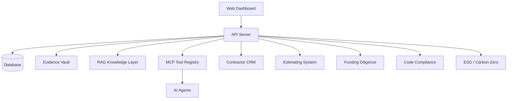

# System Architecture

## Purpose
Describe CT monorepo architecture and module boundaries.

## Scope
`apps/web`, `apps/api`, shared packages, infra, docs, prompts.

## Current Status
🟡 Scaffolded; implementation pending.

## Monorepo Structure
- `apps/web`
- `apps/api`
- `packages/shared`
- `packages/rag`
- `packages/mcp`
- `packages/contractors`
- `packages/estimating`
- `packages/funding`
- `packages/compliance`
- `infra`
- `docs`
- `prompts`

## Key Components
Web dashboard, API services, database, evidence vault, RAG, MCP, agents.

## Risks
Premature coupling and unclear ownership boundaries.

## Next Steps
Define interfaces, schemas, and service contracts.

## Owner
TBD

## Diagram

